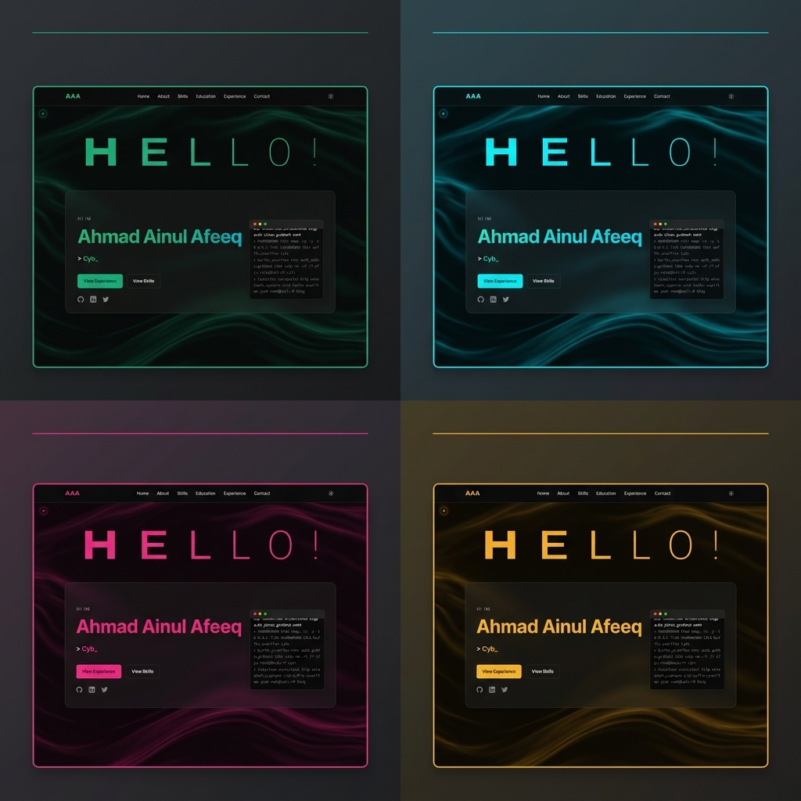

# 🛡️ Ahmad Ainul Afeeq — Cyber Security Portfolio 🌌✨

<p align="center">
  <a href="https://meowzyyy.github.io/portfolio-website/">
    
  </a>
</p>

<p align="center">
  
  
  
  
</p>

---

## 📖 Welcome to the Core Terminal

This is a premium, high-fidelity personal digital portfolio themed around **Cyber Security** and **Futuristic Interface Engineering**. Built with pure vanilla tech stacks, it implements advanced interactive UI modules, hardware-accelerated WebGL simulations, and custom retro-synthesized audio tools to offer visitors an immersive, gamified experience.

---

## 📸 Website Preview

<p align="center">
  
</p>

---

## 🎮 Premium & Interactive Highlights

Here are the custom-engineered interactive features integrated into the client experience:

| Feature | Tech Mechanism | Description |
| :--- | :--- | :--- |
| **🎨 Accent Color Customizer** | CSS Variables + JS `localStorage` | In-navigation control panel supporting 4 presets (**Green**, **Cyan**, **Pink**, **Amber**). Clicking updates `--primary-color`, dynamic gradients, typography, and interactive canvases in real-time. |
| **🌀 WebGL Liquid Ether** | Three.js + Custom Fluid Shader | A GPU-accelerated fluid simulation background that reacts to mouse clicks, drag forces, and moves elegantly in autopilot when idle. Automatically swaps palette stops when switching theme accents. |
| **🕹️ Retro Arcade Cabinet** | HTML5 `iframe` + Web Audio API | A draggable, responsive 3D retro arcade cabinet. Users can play *Jhonny Bird* inline, featuring dynamically synthesized 8-bit sound effects (coin inserts, jumps, crashes) built using code on the browser's Web Audio synthesizer. |
| **🖱️ Ultra-Smooth Cyber Cursor** | RequestAnimationFrame LERP | A hardware-accelerated magnetic cursor tracker. Follows the cursor using linear interpolation (LERP) and expands dynamically on hover with smooth CSS `color-mix` glowing borders. |
| **🎡 3D Circular Gallery** | Three.js + WebGL Canvas | An interactive, rotating carousel highlighting personal hobbies (Music, Gaming, Cyber Security) that spins in 3D space and handles smooth drag & swipe controls. |
| **🔤 Typographic Text Pressure** | SVG Path + Dynamic Weight | A liquid-style "Hello!" banner at the top of the hero section that responds organically to the proximity of the user's mouse. |
| **🛰️ Live Visitor Counter** | Express API + Filesystem Sync | A backend visitor tracker API displaying live visitor stats dynamically on the dashboard. |

---

## 🛠️ Deep Tech Stack & Utilities

* **Core Frontend:** Core HTML5, Vanilla CSS3 (Custom Glassmorphic styles), JavaScript (ES6+ Closures)
* **Graphics & Renderers:** Three.js, WebGL Shader Uniforms, Canvas 2D
* **Audio Synthesis:** Web Audio API (OscillatorNode, GainNode, BiquadFilterNode)
* **API Integrations:** Web3Forms API (Direct Gmail routing for secure messages)
* **Backend:** Node.js, Express.js
* **CI/CD:** GitHub Actions (Automated static deployments)

---

## 💻 Local Development Setup

To run this project locally, clone and start the development server:

1. **Clone the Repository**
   ```bash
   git clone https://github.com/MeowZyyy/portfolio-website.git
   cd portfolio-website
   ```

2. **Install Dependencies**
   ```bash
   npm install
   ```

3. **Start Server**
   ```bash
   # Starts express server on port 3000
   npm start
   ```

4. **Launch Application**
   Open your browser and navigate to `http://localhost:3000`.

---

<p align="center">
  <i>Designed and coded with 💚 by Ahmad Ainul Afeeq. Forged for maximum visual security & style.</i>
</p>
